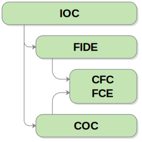

+++
title = "Organisations - Ci-dessus"
layout = "ws-single"
+++

## IOC - International Olympic Committee

The _[International Olympic Committee](https://www.olympic.org/)_ (IOC)
[reconnaît](https://www.olympic.org/world-chess-federation)
the [FIDE](https://www.fide.com/)
comme l'instance dirigeante mondiale du sport d'échecs.

Le IOC [reconnaît](https://www.olympic.org/canada) également
le [COC](https://olympic.ca/)
en tant que Comité National Olympique (CNO) pour le Canada.

## FIDE - Fédération Internationale des Échecs

La _[Fédération Internationale des Échecs](https://www.fide.com/)_ (FIDE),
est l'instance dirigeante mondiale du sport d'échecs.

FIDE [reconnaît](https://www.fide.com/directory/member-federations)
le [FCE / CFC](https://www.chess.ca/)
en tant que Fédération membre du Canada.

La FIDE a été fondée le 20 juin 1924 lors des Jeux Olympiques (sportifs) organisés à Paris, en France.
Le Canada était l'un des 15 pays fondateurs de la FIDE (avant l'adhésion de l'URSS et des États-Unis).

FIDE se compose de (voir [geography of chess](https://en.wikipedia.org/wiki/Geography_of_chess)):
* Quatre (4) organisations continentales: [Africa](http://africa-chess.org/),
  [Americas](https://www.fideamerica.com/), [Asia](http://www.asianchess.com/),
  et [Europe](http://www.europechess.org/).
* Vingt-sept (27) zones. La plupart des zones se composent de plusieurs pays.
  La zone 2.2 comprend uniquement le Canada.

## COC - Canadian Olympic Committee

Le _[Canadian Olympic Committee](https://olympic.ca/)_ (COC)
est le Comité National Olympique (CNO) du Canada.

COC [reconnaît](https://olympic.ca/coc-recognized-organizations/)
le [FCE / CFC](https://www.chess.ca/)
en tant qu'organisme directeur national du sport des échecs au Canada.
Voir la [lettre de reconnaissance](recognition-letter-chess1.pdf).

## Autres organisations

* Le [Commonwealth Chess Association](http://www.commonwealthchess.com/)
  est une organisation d'échecs dans les pays du Commonwealth britannique.
* L'[International Correspondence Chess Federation](https://www.iccf.com/).
