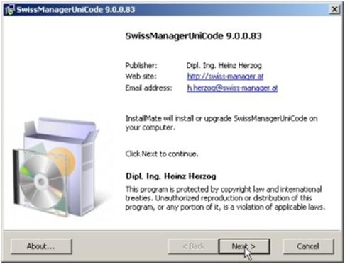
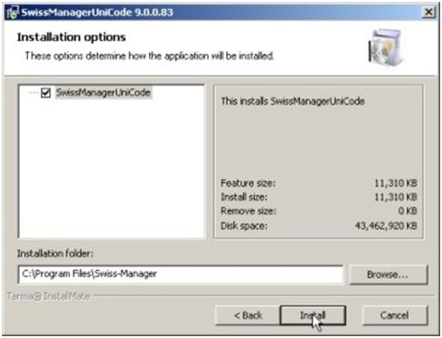
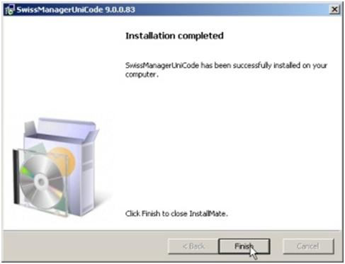
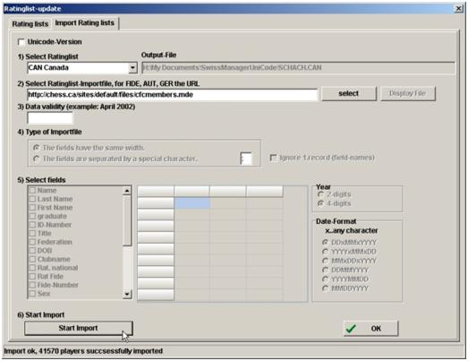
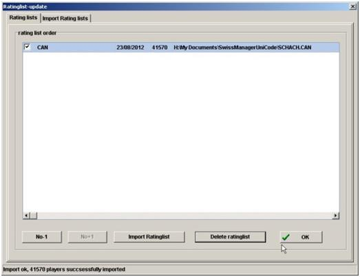
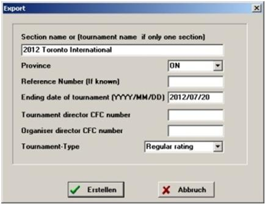

+++
title = "Tools - Swiss-Manager"
layout = "ws-single"
+++

The CFC has negotiated an agreement with [Swiss-Manager](http://swiss-manager.at/)!
Tournament directors in Canada can use Swiss-Manager free of charge to run their CFC tournaments.

Use the Database of CFC Members, the CFCmembers.mde file, for registration of players.
It contains both CFC and FIDE ids and ratings.
Designate ID #2 as "FIDE NUMBER" and Rating #2 as "FIDE Rating" (this should save a lot of work for all). 

## Downloads

* Download [Swiss-Manager Sofware](http://swiss-manager.at/download.aspx?lan=1)
* Download [Database of CFC Members](https://storage.googleapis.com/cfc-public/data/cfcmembers.mde)

## Install Instructions

1. Run SwissManagerUniCodeSetup.exe
    
    
    

1. When you first start Swiss Manager enter the registration code you received from the CFC

3. Download the latest CFC database from "Rating lists"->"Update CAN-ratinglist"
    

   * If you don’t have an Internet connection you must have the cfcmembers.mde file in your computer.
   * Verify that you are using the CAN rating list in the "Rating lists" tab
      

4. Two files are required by the CFC: XXXX.ctr and XXXX.tms.
   They are created by the menu item "specials" -> "Rtg. admin. file CAN"
    

   * The files are created in \My Documents\Swiss-Manager\Listen folder.
   * Email these two files as attachments to info@chess.ca