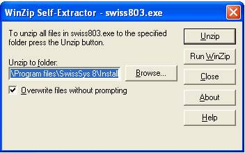
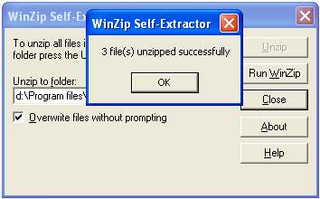
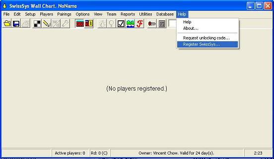
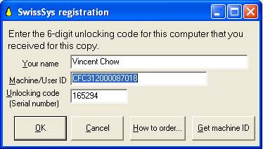
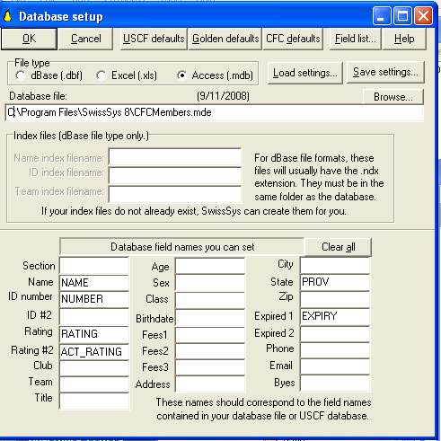

+++
title = "Tools - SwissSys"
layout = "ws-single"
content_todo = "Update for SwissSys 10 (now has 8 and 9)"
+++

The CFC has negotiated an agreement with [SwissSys](http://www.swisssys.com/)!
Tournament directors in Canada can use SwissSys free of charge to run their CFC tournaments.

Use the Database of CFC Members, the CFCmembers.mde file, for registration of players.
It contains both CFC and FIDE ids and ratings.
Designate ID #2 as "FIDE NUMBER" and Rating #2 as "FIDE Rating" (this should save a lot of work for all). 

## Downloads

* Download [SwissSys Software](https://www.swisssys.com/downloads.html) (Windows only).
* Download [Database of CFC Members](https://storage.googleapis.com/cfc-public/data/cfcmembers.mde)

## FAQ

* Q: What happens when the subscription expires? 
   A: The information is not lost and can be resumed after the entry of another valid registration code.
* Q: How often is the CFC Members database updated? 
   A: Weekly.
* Q: What is the advantage of using SwissSys or Swiss Assistant? 
   A: Find players more easily. See membership status. Automated pairings. Reduce errors.
  Program generates crosstables for submission to the CFC.
* Q: Who can request a free subscription? 
   A: Tournament directors intending to run a CFC rated tournament.
* Q: When should I get the subscription? 
   A: A couple of weeks before the tournament. We will generally issue a subscription that is good for a month.
  Large tournaments will be longer. Get set up early for advanced entries and things will go more smoothly.
* Q: What should I send the CFC? 
   A: Two files are required by the CFC. They are XXXX.ctr and XXXX.tms .
  They are created by the menu item "Utilities" ... "Ratings report for the CFC".
  They are saved by default in C:\Program Files\SwissSys 9\Events\. 
  Email these 2 files as attachments to info@chess.ca.

## Install Instructions

To install the program: 

1. Run swiss8.exe or unzip SwissAssistant1.zip.
    
 
1. Click Unzip in WinZip Self Extractor window.
   It will save 3 files to c:\program files\SwissSys 8\Install (change the directory if you want).
     

1. Click OK. Then click Close. 

1. Use "My Computer" to go to the unzipped files at 
   c:\program files\SwissSys 8\Install. Run setup.exe (application). 

1. Register subscription which would have been emailed back to you.
    
 
1. Enter Machine/UserId. Enter Unlocking Code. (code shown is expired) 
    

1. To set up the CFC Database:
   * In top menu click Database.
   * In drop down list click Database setup... 
   * In Database setup screen click Access (.mdb)
   * In Database setup screen click Browse... 
   * Open CFCMembers.mde (put the database anywhere, but simplest is in swisssys directory, e.g.
     C:\Program Files\SwissSys 8\CFCMembers.mde)
   * In Database setup screen click CFC defaults.
   * Your screen should look something like this:
       
   * In Database setup screen click OK.
   * The CFC database is now set up and SwissSys is ready for use.
