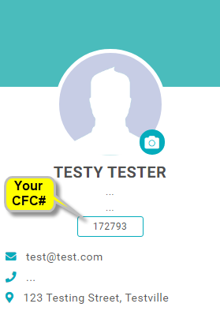
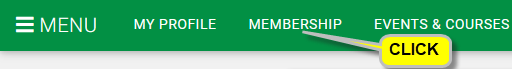
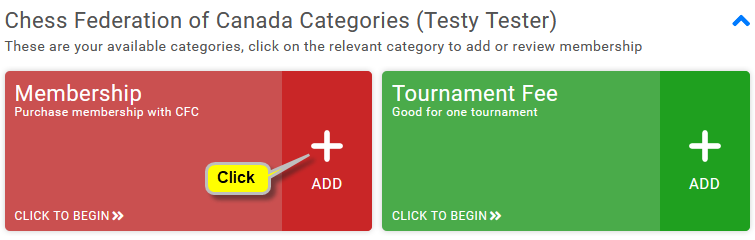
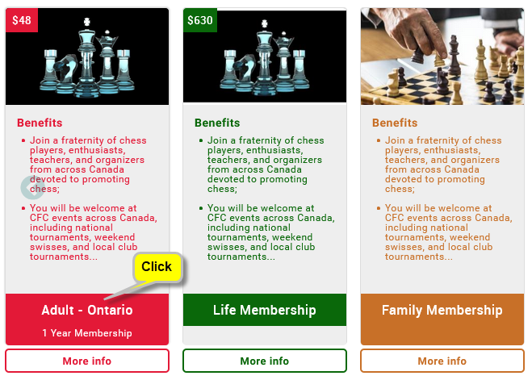
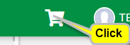

+++
title = "Adhésion FCE - Comment"
layout = "ws-single"
pageid = "pg-membership-how"
tableofcontents = false
+++

Merci d'avance pour votre adhésion au FCE !
Une adhésion aux FCE soutient non seulement le jeu et le sport des échecs au Canada,
il vous permet de participer à des tournois classés FCE.

Le FCE utilise un système appelé GoMembership pour gérer ses adhésions.
Après votre adhésion, vous aurez un identifiant et un mot de passe sur GoMembership
pour votre adhésion au FCE.

Voir [Types d'adhésion au FCE et frais](/fr/players/membership-fees/).

Parents, vous pouvez configurer GoMembership pour votre enfant et le transmettre
lorsqu'il sera plus âgé.

Comment adhérer ou renouveler ?
Sélectionnez les réponses aux questions suivantes pour obtenir des instructions
spécifiques:

<select x-model="mbr.is_member">
  <option value="">Q: Êtes-vous membre du FCE?</option>
  <option value="N">Je n'ai jamais été membre du FCE</option>
  <option value="Y">Je suis membre du FCE</option>
  <option value="Y">J'étais membre du FCE dans le passé</option>
</select>

Puisque vous êtes ou avez été membre du FCE, un compte GoMembership a déjà été créé pour vous.
Votre identifiant GoMembership et votre numéro de membre FCE sont les mêmes.

 

  <select x-model="mbr.knows_cfc_id">
   <option value="">Q: Connaissez-vous votre numéro de membre FCE?</option>
   <option value="Y">Je connais mon numéro de membre FCE</option>
   <option value="N">Je ne connais pas mon numéro de membre FCE</option>
  </select>
 

 

  

   <select x-model="mbr.knows_gm_pw">
    <option value="">Q: Connaissez-vous votre mot de passe GoMembership?</option>
    <option value="Y">Je connais mon mot de passe GoMembership</option>
    <option value="N">Je ne connais pas mon mot de passe GoMembership</option>
   </select>
  

 

<!-- --------------------------------------------------------------- -->

Pour devenir membre FCE, vous devez remplir
DEUX étapes : 1) créer un identifiant sur GoMembership et 2) acheter un abonnement FCE.

## Créer un identifiant GoMembership

* Cliquez sur ce bouton pour accéder à GoMembership:
   <a class="button is-info" href="https://cfc.azolve.com/" target="_blank">Aller à GoMembership</a>
  
* Sur la page de connexion GoMembership, cliquez sur le bouton "Sign Up"
  situé près du côté inférieur droit.

* Sur la page "Sign Up", entrez TOUTES vos informations
  * Pour Association provinciale, sélectionnez la province dans laquelle vous résidez.
  * IMPORTANT! N'oubliez pas votre mot de passe GoMembership.
  * Cliquez sur le bouton "Sign Up" en bas.

* Sur la page Accords et inscriptions, cliquez simplement
  sur "Accept and Continue".

* Ensuite, vous devriez voir votre page d'accueil dans GoMembership.
  * S'il apparaît, fermez la fenêtre contextuelle (cliquez sur le "X").
  
* IMPORTANT! N'oubliez pas votre numéro FCE.
  Vous devrez le fournir lorsque vous entrez FCE-rated tournois.
  De plus, vous pouvez l'utiliser plus tard pour vous reconnecter à GoMembership
  (avec votre mot de passe; souvenez-vous-en aussi). 
  

* Vous avez maintenant un numéro FCE mais vous n'avez pas encore de membre FCE actif.
  Suivez les instructions ci-dessous pour acheter un abonnement FCE.

<!-- --------------------------------------------------------------- -->

Un compte GoMembership a déjà été créé pour votre ancien numéro FCE.
Ne créez PAS un nouveau compte GoMembership (il aura un numéro FCE différent).

## Réinitialisez votre mot de passe GoMembership (partie 1 sur 2)

* Cliquez sur ce bouton pour accéder à GoMembership:
   <a class="button is-info" href="https://cfc.azolve.com/" target="_blank">Aller à GoMembership</a>

* Sur la page de connexion GoMembership,
  * Dans la case Nom d'utilisateur (la 1ère case), entrez votre numéro FCE.
  * Cliquez sur "Forgot Password?" lien (sous les champs de saisie).
  * Dans le message contextuel "Password Reset", cliquez sur "OK".

* chess.ca / GoMembership vous enverra des instructions par courriel.
  Vérifiez votre boîte de réception et vos dossiers SPAM ou JUNK.
  * L'e-mail peut prendre jusqu'à 15-30 minutes pour que l'e-mail arrive.
  * L'e-mail n'arrivera jamais si nous n'avons pas votre identifiant
    de messagerie actuel dans nos fichiers.

* Après avoir attendu 15 à 30 minutes (et vérifié vos dossiers SPAM ou JUNK),
  répondez à cette question:

 

  <select x-model="mbr.got_reset_email">
  <option value="">Q: Avez-vous reçu un e-mail de réinitialisation de mot de passe?</option>
   <option value="Y">J'ai reçu un e-mail de réinitialisation de mot de passe</option>
   <option value="N">Je n'ai pas reçu d'e-mail de réinitialisation de mot de passe</option>
  </select>
 

<!-- --------------------------------------------------------------- -->

## Réinitialisez votre mot de passe GoMembership (partie 2 sur 2)

Suivez les instructions dans le courriel de chess.ca / GoMembership.
* Cliquez sur le lien "Reset Password" qui se trouve dans l'e-mail.
* Dans le message contextuel "Password Reset", entrez votre nouveau mot de passe (deux fois).
  et cliquez sur le bouton "Enregistrer".
* IMPORTANT! N'oubliez pas votre nouveau mot de passe GoMembership.

<!-- --------------------------------------------------------------- -->

## Connectez-vous à GoMembership
Accédez à GoMembership (utilisez le bouton ci-dessous).
Si vous n'êtes pas déjà connecté, vous verrez la page de connexion :
* Dans la case "Username" (la 1ère case), entrez votre numéro FCE.
* Dans la case "Password" (la 2e case), entrez votre mot de passe.

Une fois connecté, suivez les instructions ci-dessous pour acheter une adhésion FCE.

<a class="button is-info" href="https://cfc.azolve.com/" target="_blank">Aller à GoMembership</a>

<!-- --------------------------------------------------------------- -->

## Acheter un abonnement FCE

* Une fois connecté à GoMembership, cliquez sur "Membership" dans la barre de menu supérieure.
  
  
  
* Cliquez sur le type d'adhésion que vous souhaitez acheter:
  
  
  
* Les types d'adhésion qui s'offrent à vous en fonction de votre âge et de votre province
  affiliation (définie dans votre profil) sont affichés. Cliquez sur un type:
  
  
  
* Le type d'adhésion est maintenant sélectionné. Aller au "panier"
  pour terminer le processus, cliquez sur l'icône du panier (en haut à droite)
  
  
  
* Continuez votre achat (similaire à d'autres boutiques en ligne).

<!-- --------------------------------------------------------------- -->

## Contacter le FCE pour trouver mon numéro FCE
Ne vous inscrivez PAS dans GoMembership car cela créera un nouveau numéro FCE.
Un compte GoMembership a déjà été créé pour votre ancien numéro FCE.
Nous devons juste le trouver pour vous.

Tout d'abord, recherchez votre nom sur [la liste des cotes](/fr/ratings/#/).
Si vous trouvez votre nom, votre ancien identifiant FCE sera répertorié avec.

Si vous ne trouvez toujours pas votre identifiant FCE,
contactez le FCE pour obtenir de l'aide.
Fournissez tous les détails qui pourraient nous aider à le trouver.

<a class="button is-info" href="https://forms.gle/miag39Q6tutM7pmc7" target="_blank">Contactez le FCE</a>

<!-- --------------------------------------------------------------- -->

## Contactez le FCE
Contactez le FCE pour que votre identifiant e-mail soit ajouté
à votre identifiant GoMembership.

<a class="button is-info" href="https://forms.gle/miag39Q6tutM7pmc7" target="_blank">Contactez le FCE</a>

