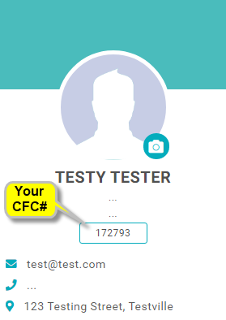
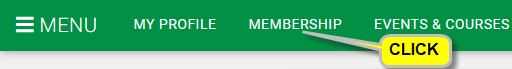

+++
title = "CFC Membership - How"
layout = "ws-single"
pageid = "pg-membership-how"
tableofcontents = false
+++

Thanks in advance for joining the CFC!
A CFC membership not only supports the game and sport of chess in Canada,
it allows you to participate in CFC-rated tournaments.

The CFC uses a system called GoMembership to manage its memberships.
After joining, you will have an id & password on GoMembership for your CFC membership.

See [CFC membership types and fees](/en/players/membership-fees/).

Parents, you can set up GoMembership for your child and pass it along when she/he is older.

How to join or renew?
Select answers to the following questions to get specific instructions:

<select v-model="mbr.is_member">
  <option value="">Q: Are you a CFC member?</option>
  <option value="N">I have never been a CFC member</option>
  <option value="Y">I am a CFC member</option>
  <option value="Y">I was a CFC member in the past</option>
</select>

Since you are/were a CFC member, a GoMembership account has already been created for you.
Your GoMembership id and your CFC membership number are the same.

 

  <select v-model="mbr.knows_cfc_id">
   <option value="">Q: Do you know your CFC membership number?</option>
   <option value="Y">I know my CFC membership number</option>
   <option value="N">I do not know my CFC membership number</option>
  </select>
 

 

  

   <select v-model="mbr.knows_gm_pw">
    <option value="">Q: Do you know your GoMembership password?</option>
    <option value="Y">I know my GoMembership password</option>
    <option value="N">I do not know my GoMembership password</option>
   </select>
  

 

<!-- --------------------------------------------------------------- -->

To become a CFC member, you must complete
BOTH steps: 1) create an id on GoMembership and 2) buy a CFC membership.

## Create a GoMembership id

* Click this button to go to GoMembership:
   <a class="button is-info" href="https://cfc.azolve.com/" target="_blank">Go to GoMembership</a>
  
* On the GoMembership log-in page, click the "Sign Up" button located near the bottom right side.

* On the Sign Up page, enter ALL your information
  * For Provincial Association, select the province in which you reside.
  * IMPORTANT! Remember your GoMembership password.
  * Click the "Sign Up" button at the bottom.

* On the Agreements & Opt-ins page, just click "Accept & Continue".

* Next you should see your home page within GoMembership.
  * If it appears, close the pop-up window (click the "X").
  
* IMPORTANT! Remember your CFC number. You will need to provide it when you enter CFC-rated
  tournaments. Also, you can use it later to log in to GoMembership again (with your password;
  remember it too). 
  

* You now have a CFC number but you do not yet have an active CFC membership.
  Follow the instructions below to buy a CFC membership.

<!-- --------------------------------------------------------------- -->

A GoMembership account has already been created for your old CFC number.
Do NOT create a new GoMembership account (it will have a different CFC number).

## Reset Your GoMembership Password (Part 1 of 2)

* Click this button to go to GoMembership:
   <a class="button is-info" href="https://cfc.azolve.com/" target="_blank">Go to GoMembership</a>

* On the GoMembership log-in page, 
  * In the Username box (the 1st box), enter your CFC number.
  * Click the "Forgot Password?" link (below the input boxes).
  * On the "Password Reset" pop-up message, click "OK".
  
* chess.ca / GoMembership will email instructions to you. Check your email inbox and SPAM or JUNK folders.
  * The email may take up to 15-30 minutes for the email to arrive.
  * The email will never arrive if we do not have your current email id on file.
  
* After waiting 15-30 minutes (and checking your SPAM or JUNK folders), answer this question:

 

  <select v-model="mbr.got_reset_email">
  <option value="">Q: Did you receive a password reset email?</option>
   <option value="Y">I did receive a password reset email</option>
   <option value="N">I did not receive a password reset email</option>
  </select>
 

<!-- --------------------------------------------------------------- -->

## Reset Your GoMembership Password (Part 2 of 2)

Follow the instruction in the email from chess.ca / GoMembership.
* Click the "Reset Password" link found inside the email.
* On the "Password Reset" pop-up message, enter your new password (twice).
  and click the "Save" button.
* IMPORTANT! Remember your new GoMembership password.

<!-- --------------------------------------------------------------- -->

## Log in to GoMembership
Go to GoMembership (use the button below).
If you are not already logged in, you will see the log in page:
* In the Username box (the 1st box), enter your CFC number.
* In the Password box (the 2nd box), enter your password.

Once logged in, follow the instructions below to buy a CFC membership.

<a class="button is-info" href="https://cfc.azolve.com/" target="_blank">Go to GoMembership</a>

<!-- --------------------------------------------------------------- -->

## Buy a CFC Membership

* While logged in to GoMembership, click "Membership" in the top menu bar.
  
  
  
* Click the membership type you want to buy:
  
  
  
* The membership types available to you based on your age and provincial
  affilation (set within your profile) are shown.  Click a type:
  
  
  
* The membership type is now selected.  To go the the "shopping cart"
  to complete the process, click the cart icon (top right)
  
  
  
* Continue your purchase (similar to other web stores).

<!-- --------------------------------------------------------------- -->

## Contact the CFC to Find My CFC Number
Do NOT sign up in GoMembership as that will create a new CFC number.
A GoMembership account has already been created for your old CFC number.
We just need to find it for you.

First, search for your name on [the Ratings list](/en/ratings/#/).
If you find your name, your old CFC id will be listed with it.

If you still cannot find your CFC id, contact the CFC for help.
Provide any details that might help us find it.

<a class="button is-info" href="https://forms.gle/miag39Q6tutM7pmc7" target="_blank">Contact the CFC</a>

<!-- --------------------------------------------------------------- -->

## Contact the CFC
Contact the CFC to have your email id added to your GoMembership id.

<a class="button is-info" href="https://forms.gle/miag39Q6tutM7pmc7" target="_blank">Contact the CFC</a>

